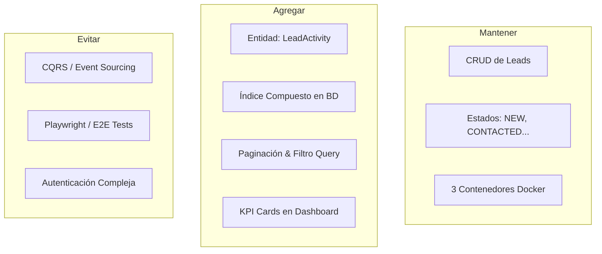

# Propuesta Arquitectónica: Definición de Alcance V1

*Evaluación de Portfolio Profesional: Lead & Customer Management System*

Este documento establece la propuesta del Arquitecto de Software Senior para el alcance de la versión 1.0 (V1). Se enfoca en maximizar el impacto técnico ante evaluadores, minimizando la sobreingeniería para asegurar la entrega del proyecto en pocas semanas.

---

## 1. Análisis de Áreas y Justificación Técnica

### A. Modelo de Datos y Relaciones
*   **Decisión**: **No** mantener una sola tabla. Agregar una sola entidad adicional: `LeadActivity` (Historial de Actividad).
*   **Justificación**: Un portfolio backend con una sola tabla parece un "ejercicio escolar". Agregar una relación Uno a Muchos (One-to-Many) entre `Lead` y `LeadActivity` demuestra:
    *   Diseño relacional real (Foreign Keys, integridad referencial y cascada).
    *   Consultas con `JOINs` optimizados a nivel de repositorio.
    *   Estructura de negocio realista: los comerciales no solo editan leads; registran actividades (llamadas, notas de reuniones, emails).
*   **Campos de `LeadActivity`**: `id` (int), `lead_id` (int, FK), `type` (Enum: CALL, EMAIL, NOTE), `notes` (text), `created_at` (datetime).

### B. Base de Datos (PostgreSQL)
*   **Índices recomendados**:
    *   Índice único (`UniqueConstraint`) en `lead.email`.
    *   Índice compuesto en `(status, created_at)` en la tabla `Lead` para optimizar las consultas de listado, ordenamiento y filtrado.
*   **Restricciones (Constraints)**:
    *   `CheckConstraint` en `lead.status` para asegurar a nivel de motor que solo entren estados válidos (`NEW`, `CONTACTED`, `QUALIFIED`, `LOST`).
    *   `NotNull` en nombre, email y estado.
*   **Validaciones**:
    *   Validación de formato de email mediante Regex en el modelo Pydantic del API, y control de unicidad capturando la excepción de integridad de la base de datos (`UniqueViolation`) en el repositorio.

### C. Diseño del API REST
*   **Paginación obligatoria**: Implementar paginación por desplazamiento (`limit` y `offset`) en `GET /leads`. Un API profesional de portfolio demuestra que sabe manejar grandes volúmenes de datos de forma eficiente.
*   **Filtros y Búsquedas**:
    *   Filtrado exacto por `status`.
    *   Búsqueda de texto parcial (`query`) insensible a mayúsculas/minúsculas sobre `name`, `email` y `company`.
*   **Endpoints de Actividad**:
    *   `POST /leads/{id}/activities`: Registrar una llamada/nota.
    *   `GET /leads/{id}/activities`: Obtener la línea de tiempo del lead.
*   **Endpoint de Métricas (`GET /metrics`)**: Agrega una consulta analítica de agregación agrupando leads por estado para alimentar las tarjetas del Dashboard directamente, demostrando destrezas en queries de agregación eficientes.

### D. Dashboard Administrativo (NiceGUI)
*   **Enfoque 100% Python**: La interfaz gráfica se construye usando exclusivamente **NiceGUI**, eliminando la necesidad de JavaScript, frameworks frontend complejos (React, Vue) o CSS personalizado avanzado. Se demuestra la capacidad de diseñar interfaces operativas rápidas y consistentes.
*   **Métricas de Embudo (KPI Cards)**: Se consumen asíncronamente desde `GET /metrics` y se presentan en la parte superior mostrando totales agrupados: Leads Nuevos, Contactados, Calificados y Perdidos.
*   **Línea de Tiempo (Timeline)**: En la vista de detalle de cada lead, se muestra la lista cronológica de sus interacciones (`LeadActivity`) obtenida del backend, con un formulario NiceGUI integrado para registrar nuevas notas al instante.

### E. Arquitectura del Software
*   **Patrones Aprobados (Alta Cohesión/Bajo Acoplamiento)**:
    *   *Repository Pattern*: Abstracción total de SQLAlchemy.
    *   *Service Layer*: Lógica de negocio pura e independiente en Python.
    *   *Dependency Injection*: Desacoplamiento e inyección por constructores.
*   **Patrones Rechazados (Sobreingeniería)**:
    *   *CQRS / Event Sourcing*: Complejidad artificial innecesaria para la escala.
    *   *Hexagonal Architecture Estricta*: Demasiados adaptadores y puertos abstractos innecesarios. Una estructura modular de 3 capas limpias (API -> Service -> Repository) es más que suficiente y fácil de leer.

### F. Estrategia de Testing (Verificabilidad)
*   **Suite Mínima Profesional**:
    *   *Unit Tests*: Probar la lógica de transiciones de estado en `LeadService` y la validación de unicidad de email utilizando dobles de prueba (mocks) para el repositorio.
    *   *Integration Tests*: Ejecutar llamadas HTTP usando `TestClient` contra una base de datos real (PostgreSQL de prueba) levantada temporalmente, validando que las restricciones de base de datos e índices funcionen correctamente y revirtiendo la transacción después de cada test.
*   **Pruebas a Evitar**:
    *   Tests de interfaz de usuario de extremo a extremo (E2E) con Selenium o Playwright (muy inestables y requieren demasiado tiempo de mantenimiento).
    *   Tests unitarios sobre repositorios que no contienen lógica (SQLAlchemy no requiere ser testeado unitariamente, se prueba a nivel de integración).

---

## 2. Resumen Estratégico de Cambios para la V1

### 1. Qué mantener exactamente igual
*   **La infraestructura**: 3 contenedores Docker (PostgreSQL, FastAPI Backend, Dashboard Web).
*   **Los estados del Lead**: `NEW`, `CONTACTED`, `QUALIFIED`, `LOST`.
*   **Las operaciones básicas**: CRUD básico de Leads en el API y en el Dashboard.

### 2. Qué agregar (Valor Máximo / Complejidad Mínima)
*   **Entidad `LeadActivity`**: Relación 1:N simple para guardar el historial de interacciones de cada lead.
*   **Paginación y Búsqueda en API**: Parámetros `limit`, `offset` y `query` en `GET /leads`.
*   **Índices y Restricciones**: Índice único de correo y Check Constraints de estados en base de datos.
*   **Indicadores Visuales en Dashboard**: KPI Cards de embudo de ventas y línea de tiempo de notas en el detalle del Lead.
*   **Tests de Integración Reales**: Testeo con base de datos de pruebas PostgreSQL real y rollback transaccional automático.

### 3. Qué eliminar
*   La idea de que el lead se maneja en una sola tabla aislada sin relaciones.
*   Lógica SQL o del ORM esparcida por los endpoints de FastAPI (trasladar a Servicios y Repositorios).

### 4. Qué evitar explícitamente
*   **Autenticación compleja multi-rol (RBAC)**: Consume demasiado tiempo. Se asume acceso libre o mediante un API key/token estático simple para el showcase.
*   **Arquitecturas Hexagonales/DDD estrictas**: Evitar generar carpetas y puertos innecesarios que diluyan la lectura del flujo simple.
*   **Colas de mensajería (Celery/RabbitMQ)**: No implementarlas. Las actividades del lead se registran de forma directa y sincrónica.

---

## 3. Versión Ideal del Alcance Final (V1)

La siguiente tabla resume el alcance técnico final que considero ideal para tu portfolio comercial:

| Componente | Alcance Técnico Final V1 | Habilidad Técnica que Demuestra |
| :--- | :--- | :--- |
| **Modelado** | Entidades `Lead` y `LeadActivity` (Relación 1:N). | Modelado relacional, Foreign Keys y diseño de datos. |
| **Persistencia** | SQL con SQLAlchemy, Migraciones Alembic, Unique & Check Constraints, Índices compuestos. | Administración de Bases de Datos Relacionales (PostgreSQL). |
| **API Backend** | FastAPI asíncrono, Pydantic (Validaciones), Paginación, Filtro de búsqueda, Endpoints para Leads y Actividades. | Diseño de APIs RESTful limpias, OpenAPI estándar. |
| **Arquitectura** | Estructura modular de 3 capas con Patrón Repositorio, Capa de Servicios e Inyección de Dependencias. | Clean Architecture simplificada, SOLID, desacoplamiento. |
| **Dashboard** | Dashboard operativo interactivo desarrollado en Python con NiceGUI, que consume el API de leads y métricas de forma asíncrona. | Desarrollo de aplicaciones administrativas en Python mediante NiceGUI integradas con APIs REST y bases de datos relacionales. |
| **Testing** | Tests Unitarios (Services con Mocks) + Tests de Integración (API + PostgreSQL real con rollback). | TDD/Testing automatizado profesional y reproducibilidad. |
| **DevOps** | Docker Compose de 3 servicios (`backend`, `frontend`, `db`) con NiceGUI, FastAPI y PostgreSQL contenerizados. | Contenerización de servicios Python, configuración de red y variables de entorno. |
